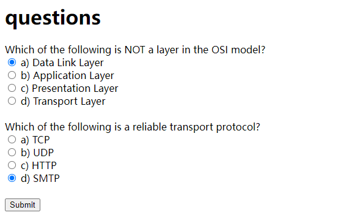
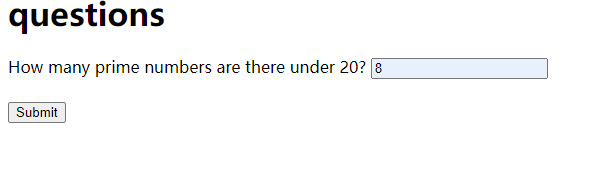
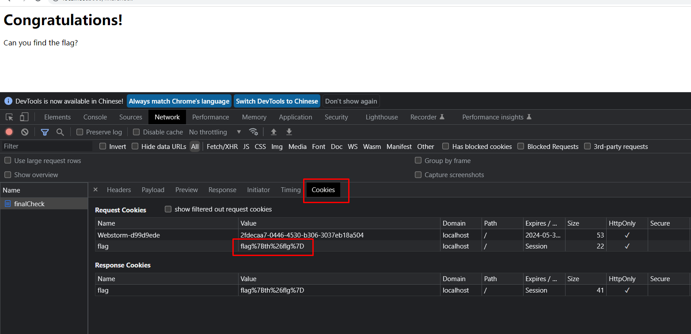

# ctf_proj
1. How to start the project:
   cd to the project directory: cd ctf_proj/bin
    run the following command: node www
2. How to find the flag:
   First, open the browser and go to the following url: http://localhost:3000/
   Second, answer the questions and click the submit button. 
    
   Third, answer next questions and click the submit button. 
    
   Finally, you will see the flag here.
    
```
